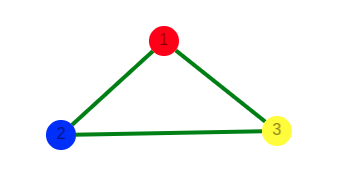
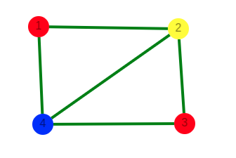
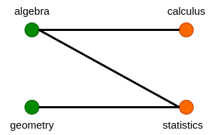

**Graph coloring** is the procedure of assignment of colors to each vertex of a graph G such that no adjacent vertices get same color. The objective is to minimize the number of colors while coloring a graph. The smallest number of colors required to color a graph G is called its chromatic number of that graph.
This is also known as vertex coloring.

***Chromatic Number:*** 
The smallest number of colours needed to colour a graph G is called its chromatic number.

For example, in the above image, vertices can be coloured using a minimum of 2 colours.Hence the chromatic number of the graph is 2.

#### Method to Color a Graph

The steps required to color a graph G with n number of vertices are as follows

- Step 1 − Arrange the vertices of the graph in some order.

- Step 2 − Choose the first vertex and color it with the first color.

- Step 3 − Choose the next vertex and color it with the lowest numbered color that has not been colored on any vertices adjacent to it. If all the adjacent vertices are colored with this color, assign a new color to it. Repeat this step until all the vertices are colored.

In the above figure, at first vertex 1 is colored red. As the adjacent vertices of vertex 1 are again adjacent, vertex 2 and vertex 4 are colored with different color, yellow and blue respectively. Then vertex 3 is colored as red as no adjacent vertex of c is colored red. Hence, we could color the graph by minimum 3 colors. Hence, the chromatic number of the graph is 3.

#### Applications of Graph Colouring

- **Scheduling**
    Lets take an example of Exam Scheduling. Let’s suppose algebra, calculus, statistics and geometry are four courses of study in our college. And let’s say that following pairs have common students :

    - algebra and statistics
    - algebra and calculus
    - statistics and geometry
    **Problem**: Say algebra and statistics exam is held on same day then students taking both courses have to miss at least one exam. They can’t take both at same time. How do we schedule exams in minimum no of days so that courses having common students are not held on same day?

    **Solution : Graph Coloring**
    First draw a graph with courses as vertex and they are connected by edges if they have common students. Second color the graph such that no two adjacent vertices are assigned the same color as shown below

    

    Look at the above graph. It solves our problem. We can conduct exam of courses on same day if they have same color. So ,

    **DAY 1 :** ***Algebra and geometry***
    **DAY 2 :** ***Statistics and Calculus***

    This solves our problem of scheduling exams so that all students can take exams without worrying about missing one.

- **Map Coloring** 
 Geographical maps of countries or states where no two adjacent cities cannot be assigned same color. Four colors are sufficient to color any map. Refer [Four color map theorem](https://en.wikipedia.org/wiki/Four_color_theorem)

- **Mobile Radio Frequency Assignment**
When frequencies are assigned to towers, frequencies assigned to all towers at the same location must be different. How to assign frequencies with this constraint? What is the minimum number of frequencies needed? This problem is also an instance of graph coloring problem where every tower represents a vertex and an edge between two towers represents that they are in range of each other.

- **Sudoku** 
Sudoku is also a variation of Graph coloring problem where every cell represents a vertex. There is an edge between two vertices if they are in same row or same column or same block.

- **Register Allocation**
In compiler optimization, register allocation is the process of assigning a large number of target program variables onto a small number of CPU registers. This problem is also a graph coloring problem. 
